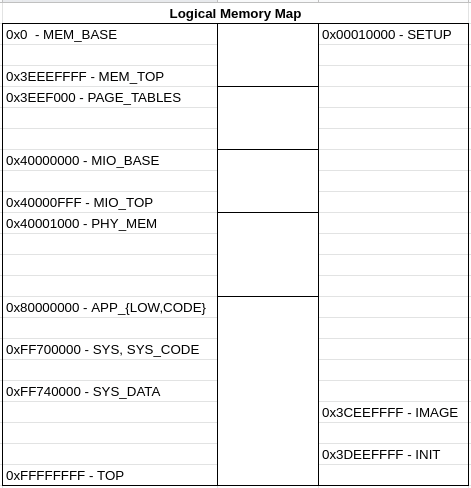

# Objetivos

* Definir um mapeamento de memória;
* Implementar os métodos referentes a abstração do acesso ao sistema de paginação a partir do SO.

# Implementações feitas

* Definimos um mapeamento de memória como na imagem abaixo, através do arquivo `/include/machine/cortex/raspberry_pi3/raspberry_pi3_traits.h`.




* Implementamos as classes e as funções no arquivo `/include/architecture/armv7/armv7_mmu.h`, baseados nas implementações já presentes nos arquivos equivalentes para as arquiteturas `ia32` e``rv32`.

# Partes validadas

Não pudemos validar a nossa implementação devido a problemas com a compilação utilizando o modo `BUILTIN`. As últimas linhas da saída que obtemos ao executar `make APPLICATION=producer_consumer all run` pode ser encontrada abaixo:

```
timeout --foreground --kill-after=2s --signal=9 60s qemu-system-aarch64 -M raspi2 -cpu cortex-a53 -smp 4 -m 1G -serial null -serial mon:stdio -nographic -no-reboot -kernel producer_consumer.bin | tee producer_consumer.out
Value of setup_offset: 0
SETUP ELF image is corrupted!
PANIC!
Machine::reboot()
Machine::reboot()
```

Observando o código que emite essa notificação em `src/setup/setup_raspberry_pi3.cc`, pudemos entender que isso estava ocorrendo por conta dos headers do ELF não serem encontrados pela função `valid()` da classe de abstração para arquivos elf `ELF`. Tentamos remover essa validação, porém nas linhas subsequentes aconteceram os mesmos erros para o arquivo de INIT e APP, então voltamos para analisar o mapeamento de memória, tentamos mudar algumas vezes a posição das coisas na memória porém sem muito sucesso.

# Como implementaríamos e validariamos as partes faltantes

Provavelmente precisaríamos arrumar o Memory Map, mas precisaríamos voltar ao ponto de início e refazer o mapeamento.

# Dificuldades encontradas

O entendimento do código já presente do EPOS criou bastante dificuldade, tanto que ficamos bastante tempo entendendo o que as funções da abstração da MMU deviam fazer, para então implementá-las. Usando muito tempo nisso, quando entendemos o que devíamos implementar já restava pouco tempo. O código de referência que o José forneceu foi de grandíssima ajuda, uma vez que a nossa versão estava ficando bem menos organizada e cada vez mais difícil de entender, embora mesmo com essa ajuda não fomos capazes de definir o mapeamento de memória.